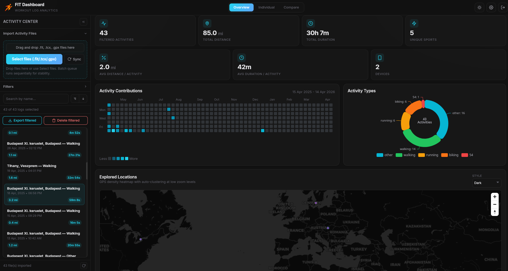
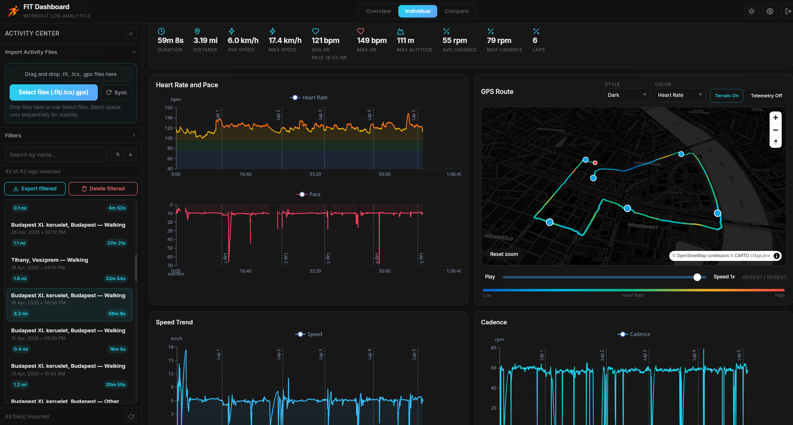
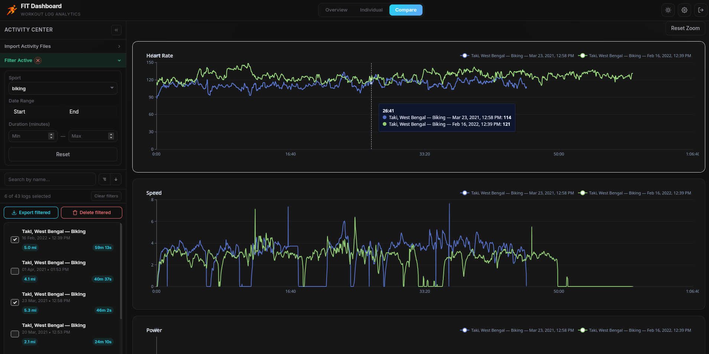

<p align="center">
  
</p>

<H1 align="center">FIT Dashboard</H1>

<p align="center">
  <a href="https://github.com/arpanghosh8453/fit-dashboard/releases">
    
  </a>
  &nbsp;&nbsp;
  <a href="https://fitdashboard.app/">
    
  </a>
  &nbsp;&nbsp;
  <a href="https://discord.gg/xVu4gK75zG">
    
  </a>
</p>

<p align="center">A high-performance activity analytics dashboard for Garmin FIT files. Available as a Tauri v2 desktop app or a Docker-deployable web app. Built with Rust, DuckDB, and React.</p>

---

## Contents

- [Features](#features)
- [Getting Started](#getting-started)
  - [Prebuilt Binaries](#prebuilt-binaries)
  - [Development](#development)
  - [Docker Deployment (Self-hosted)](#docker-deployment-self-hosted)
- [Getting FIT Files from Garmin](#getting-fit-files-from-garmin)
- [Usage](#usage)
- [Export Formats](#export-formats)
- [Tech Stack](#tech-stack)
- [Project Structure](#project-structure)
- [API Reference](#api-reference)
- [Configuration](#configuration)
- [Security](#security)
- [Acknowledgements](#acknowledgements)
- [Love This Project?](#love-this-project)
- [Declaration](#declaration)
- [License](#license)

## Screenshots

<p align="center">
  
</p>

<p align="center">
  
</p>

<p align="center">
  
</p>

## Features

- **FIT File Parsing**: Native Rust parser using the `fitparser` crate. Supports all standard Garmin FIT activity files with automatic field extraction.
- **High-Performance Storage**: DuckDB-powered analytical database with automatic downsampling for fast time-series queries. Handles hundreds of activities with millions of data points.
- **Interactive Telemetry Charts**: ECharts-powered visualization of speed, heart rate, cadence, altitude, power, and temperature. Synchronized zoom/pan with Ctrl+scroll guarding to prevent accidental navigation.
- **Activity Map**: MapLibre GL map with dynamic path coloring by metric (speed, HR, cadence, altitude, power, temperature, time). Hover tooltips show telemetry details at each point. Supports multiple map styles.
- **Overview Dashboard**: Aggregate statistics across all imported activities — total distance, total duration, activity count, and recent activity feed with interactive map overlay.
- **Advanced Filtering**: Filter by sport type, date range, duration range, and full-text search. Collapsible filter panel with bordered container design.
- **Bulk Export**: Export filtered activities as CSV, JSON, GPX, or KML. Uses the File System Access API to write directly to a chosen folder. Fallback to individual browser downloads when the API is unavailable.
- **Single Export**: Right-click any activity to export it individually via the context menu with format submenu.
- **Bulk Delete**: Delete all filtered activities at once with inline confirmation and progress overlay.
- **Inline Management**: Rename and delete activities with inline UI — no browser dialogs. All destructive actions require explicit confirmation.
- **Session Persistence**: Authentication tokens persist across browser refreshes with a configurable 72-hour TTL (web) or until logout (desktop).
- **Dark & Light Themes**: Modern glassmorphism design with CSS custom properties. Theme toggles instantly across the entire interface.
- **Responsive Layout**: Collapsible sidebar with a persistent expand strip. Works on desktop and tablet viewports.
- **Import Queue**: Batch import multiple FIT files with sequential processing for stability. Duplicate detection prevents re-importing the same file.
- **Password Protection**: Argon2-hashed credentials with session-based authentication. First-use onboarding flow for initial setup.

## Getting Started

### Prebuilt Binaries (Windows/MacOS/Linux)

Download desktop binaries from the [Releases page](https://github.com/arpanghosh8453/fit-dashboard/releases) and install for your platform:

- Linux: `.AppImage` / `.deb` (depending on release artifacts)
- macOS: `.dmg` (requires an additional De-Quarantine step, read below)
- Windows: `.msi` and `exe` installers

After installation, launch FIT Dashboard and complete onboarding on first run.

#### macOS: "App is damaged" Fix

If you downloaded the macOS build and see "FIT Dashboard is damaged and can't be opened", macOS Gatekeeper is blocking an unsigned app (this is a security warning, not a corrupted file). Use one of the methods below to open the app:

##### Method 1: Right-click to Open

1. Locate the app in your Applications folder (or wherever you placed it).
2. Right-click (or Control+click) on `FIT Dashboard.app`.
3. Select **Open** from the context menu and confirm **Open** in the dialog.

##### Method 2: Remove the quarantine attribute (Terminal)

Open Terminal and run the following. Type `xattr -cr `, then drag the `.app` bundle onto the Terminal window (it will paste the full path), then press Enter:

```bash
xattr -cr <drag-and-drop-FIT-Dashboard.app-here>
```

After running this, try opening the app again.

> **Note:** Apple charges for developer signing; unsigned releases may require these steps. This warning means Gatekeeper prevented launch, not that the file is corrupted.

### Development

#### Prerequisites

- [Rust](https://rustup.rs/) 1.70+
- [Node.js](https://nodejs.org/) 18+
- npm (bundled with Node.js)

```bash
# Clone the repository
git clone https://github.com/your-username/fit-dashboard
cd fit-dashboard

# Install frontend dependencies
npm install

# Start the Rust backend (web server mode)
cd src-tauri
cargo run --features web
# Backend starts at http://localhost:8080

# In another terminal, start the frontend dev server
cd fit-dashboard
npm run dev
# Frontend starts at http://localhost:5173

# Tauri desktop dev mode
npm run tauri:dev

# Tauri production build
npm run tauri:build
```

Open http://localhost:5173 in your browser. On first launch, the onboarding screen appears to set up your username and password.

### Docker Deployment (Self-hosted)

Use the prebuilt GHCR image:

```bash
cd docker
docker compose up -d
```

Build locally from source instead:

```bash
cd docker
docker compose -f docker-compose-build.yml up --build -d
```

Open http://localhost:8088 in your browser. The Nginx reverse proxy serves the frontend and proxies API requests to the Rust backend.

#### Data Persistence

All data (DuckDB database, config) is stored in a Docker named volume mapped to `/data/fit-dashboard` inside the container. Data persists across container restarts and image updates.

The desktop app runs the Rust backend natively with Tauri IPC — no web server needed.

## Getting FIT Files from Garmin

If your activities are in Garmin Connect, you can export FIT files in two ways.

### Option A: Bulk export all data (recommended)

Use Garmin's data export portal:

- URL: https://www.garmin.com/en-US/account/datamanagement/exportdata/

Steps:

1. Sign in with your Garmin account.
2. Go to Data Management and choose Export Your Data.
3. Request the export and wait for Garmin to prepare the archive.
4. Download the ZIP archive when it's ready from email
5. Extract the ZIP on your computer.
6. Find activity files (FIT/TCX/GPX) in the extracted folders - The exported zip contains a folder (DI_CONNECT/DI-Connect-Fitness-Uploaded-Files) containing your raw FIT activity files.
7. In FIT Dashboard, use Import to select or drag-and-drop those files.

When to use this option:

- You want a full history export.
- You are migrating from Garmin Connect to local storage.

### Option B: Export one activity at a time

Use the activity page in Garmin Connect:

- URL: https://connect.garmin.com/app/activities

Steps:

1. Open the Activities page.
2. Click an activity to open details.
3. Open the gear menu (top-right on the activity page).
4. Click Export Original (or Export TCX/GPX depending on availability).
5. Repeat for each activity you want.
6. Import downloaded files into FIT Dashboard.

When to use this option:

- You only need a few activities.
- You want to re-export specific workouts.

Tips:

- FIT is the preferred format when available, because it usually includes the richest telemetry.
- You can import `.fit`, `.tcx`, and `.gpx` files in FIT Dashboard.
- If duplicate files are imported, FIT Dashboard will skip them automatically. But if you have the save activity file in different format, it may still cause duplicate. We de-duplicate them based on file hash and exact start and end timestamp match of an activity. 

### Option C: Use Garmin-CLI tool

If you prefer the command line, [Garmin-CLI](https://github.com/vicentereig/garmin-cli) can list your activities and download the original Garmin export for a specific activity. This can be easily automated to batch download multiple activities.

**Steps:**

1. Install Garmin-CLI (`cargo install garmin-cli`, or use the pre-built MacOS/linux binary).
2. Sign in once with password and OTP (if applicable): `garmin auth login`.
3. List your activities and copy the activity ID you want: `garmin activities list`. use `--limit 20` to limit the result to last 20 activities
4. Download the original FIT export for that activity: `garmin activities download <activity-id>`

5. Unzip the downloaded archive to get the `.fit` file, then import that file into FIT Dashboard.

> [!TIP]
> You are automate the whole process with this one liner (update the limit to match your need, here it's set as 50) 
> ```bash
> garmin activities list --limit 50 | awk 'NR>2 && $1 ~ /^[0-9]+$/ {print $1}' | while read -r id; do garmin activities download "$id" && unzip "activity_${id}.zip" && rm "activity_${id}.zip"; done
>``` 

When to use this option:

- You want to batch pull individual activities without using the Garmin Connect web UI.
- You want a repeatable way to fetch specific activity files by ID.


## Usage

1. **Import**: Open the sidebar Import section and select one or more `.fit` files
2. **Browse**: Activities appear in the sidebar, sorted by date. Use filters to narrow down
3. **Analyze**: Click an activity to view telemetry charts, map path, and performance insights
4. **Export**: Right-click an activity for single export, or use "Export filtered" for bulk export
5. **Overview**: Switch to the Overview tab for aggregate statistics across all activities

## Export Formats

| Format | Description |
|--------|-------------|
| **CSV** | Full time-series with all telemetry fields. Metadata JSON embedded in the first row. Speed in both m/s and km/h. |
| **JSON** | Structured export with activity metadata and full records array. Pretty-printed for readability. |
| **GPX** | Standard GPS Exchange Format with track segments. Extensions include heart rate, cadence, and power. |
| **KML** | Google Earth format with 3D line path using absolute altitude mode. |

**Single export**: Right-click → Export → choose format → browser download.

**Bulk export**: Click "Export filtered" → choose format → select destination folder → files are written one by one with progress overlay.

## Tech Stack

### Backend (Rust)

| Component | Purpose |
|-----------|---------|
| **Tauri v2** | Desktop application framework (feature-gated behind `tauri-app`) |
| **Axum** | Web REST API server for Docker/web deployment (feature-gated behind `web`) |
| **DuckDB** | Embedded analytical database — fast aggregations over millions of records |
| **fitparser** | Native FIT file parsing — no external tools required |
| **Argon2** | Password hashing for authentication |

### Frontend (React)

| Component | Purpose |
|-----------|---------|
| **React 18 + TypeScript** | UI framework |
| **Vite** | Build tool with HMR |
| **Zustand** | Lightweight state management |
| **ECharts** | Telemetry charts with synchronized zoom |
| **MapLibre GL** | Interactive map with cooperative gestures |
| **Vanilla CSS** | Custom design system with CSS variables, dark/light theming |

## Project Structure

```
fit-dashboard/
├── src-tauri/                   # RUST BACKEND
│   └── src/
│       ├── main.rs              # Entry point (feature-gated: Tauri or Axum)
│       ├── server.rs            # Axum REST API routes
│       ├── database.rs          # DuckDB schema, queries, downsampling
│       ├── fit_parser.rs        # FIT file parsing with fitparser crate
│       ├── models.rs            # Shared data structures
│       ├── auth.rs              # Password hashing & session management
│       ├── state.rs             # Shared application state
│       └── tauri_app.rs         # Tauri IPC command handlers
│
├── src/                         # REACT FRONTEND
│   ├── components/
│   │   ├── Dashboard.tsx        # Main layout — sidebar, header, content
│   │   ├── ActivityChart.tsx    # ECharts telemetry visualization
│   │   ├── ActivityMap.tsx      # MapLibre map with path coloring
│   │   ├── ActivityInsights.tsx # Derived statistics & heatmaps
│   │   ├── SettingsPanel.tsx    # Slide-over settings drawer
│   │   ├── Onboarding.tsx      # First-use setup flow
│   │   ├── UnlockScreen.tsx    # Password unlock screen
│   │   └── DonationBanner.tsx  # Support banner
│   ├── stores/
│   │   ├── activityStore.ts    # Activity data & selection state
│   │   └── settingsStore.ts    # Theme, units, map style settings
│   ├── lib/
│   │   ├── api.ts              # Backend adapter (Tauri IPC / Axios)
│   │   └── exportUtils.ts      # CSV/JSON/GPX/KML export builders
│   ├── types.ts                # TypeScript type definitions
│   ├── styles.css              # Complete design system
│   ├── App.tsx                 # Root component with auth flow
│   └── main.tsx                # React entry point
│
├── docker/                      # DOCKER CONFIG
│   ├── Dockerfile              # Combined backend + frontend image build
│   ├── docker-compose.yml      # Prebuilt GHCR image deployment
│   ├── docker-compose-build.yml# Local source build deployment
│   └── nginx.conf              # Reverse proxy config
│
├── index.html                   # HTML entry point
├── vite.config.ts               # Vite configuration
├── tsconfig.json                # TypeScript configuration
└── package.json                 # Node.js dependencies
```

## API Reference

All endpoints require the `X-Session` header after authentication (except `/api/status`, `/api/onboard`, and `/api/unlock`).

| Method | Endpoint | Description |
|--------|----------|-------------|
| `GET` | `/api/status` | Server status and onboarding check |
| `POST` | `/api/onboard` | First-time user setup (username + password) |
| `POST` | `/api/unlock` | Authenticate and receive session token |
| `POST` | `/api/logout` | Invalidate current session |
| `POST` | `/api/import-fit` | Import FIT file (multipart form data) |
| `GET` | `/api/activities` | List all activities |
| `GET` | `/api/overview` | Aggregate statistics |
| `GET` | `/api/records/:id` | Telemetry records with `?resolution_ms=` downsampling |
| `PATCH` | `/api/activities/:id` | Rename activity |
| `DELETE` | `/api/activities/:id` | Delete activity |

## Configuration

| Setting | Default | Description |
|---------|---------|-------------|
| Session TTL | 72 hours | Web session token lifetime. Desktop tokens persist until logout. |
| API Base | `http://localhost:8080` | Backend URL, configurable via `VITE_API_BASE` env var |
| Resolution | 10,000 ms | Default telemetry downsampling interval for chart queries |
| Export Resolution | 1,000 ms | Higher-resolution records used during export operations |

## Security

> **FIT Dashboard is designed as a local-first application.** The web/Docker mode does NOT include TLS/HTTPS.

- Passwords are hashed with **Argon2** before storage
- Session tokens are generated server-side and validated on every request
- For internet-facing deployments, use a reverse proxy (Nginx, Caddy, Traefik) with TLS termination

## Acknowledgements

- [fitparser](https://crates.io/crates/fitparser) for robust FIT decoding.
- [DuckDB](https://duckdb.org/) for fast embedded analytics.
- [MapLibre GL JS](https://maplibre.org/) for rendering activity maps.
- Tile/map providers used by built-in styles:
  - [OpenStreetMap](https://www.openstreetmap.org/copyright)
  - [CARTO](https://carto.com/attributions)
  - [OpenTopoMap](https://opentopomap.org/about)
  - [Esri World Imagery](https://www.esri.com/en-us/legal/overview)
- [ECharts](https://echarts.apache.org/) for charting.
- [Tauri](https://tauri.app/) and [Axum](https://github.com/tokio-rs/axum) for desktop and web runtime foundations.

## Love This Project?

If FIT Dashboard helps your training workflow, consider supporting ongoing development:

- Give this repository a star.
- Share it with other athletes, coaches, and data enthusiasts.
- Get a supporter badge via [Ko-fi](https://ko-fi.com/s/ec2c3036ee).

## Declaration

FIT Dashboard is a personal open-source project maintained in public. I started this project as an offline alternative to my other project [garmin-grafana](https://github.com/arpanghosh8453/garmin-grafana)

- It is not affiliated with Garmin, Strava, Golden Cheetah, or any map/tile provider.
- All trademarks and product names are the property of their respective owners.
- Map data and tiles remain subject to each provider's attribution and usage terms.
- This project is AI assisted. Some feature implementations includes using Claude Opus 4.5 and Codex 5.3. Although design, artitecture, behaviour and implementation decisions are always made by myself. I test out features throughly before each release and try my best to address any reported issue within a reasonable timeline. 

## License

Copyright &copy; 2025 Arpan Ghosh. Licensed under the [GNU Affero General Public License v3.0](LICENSE).
